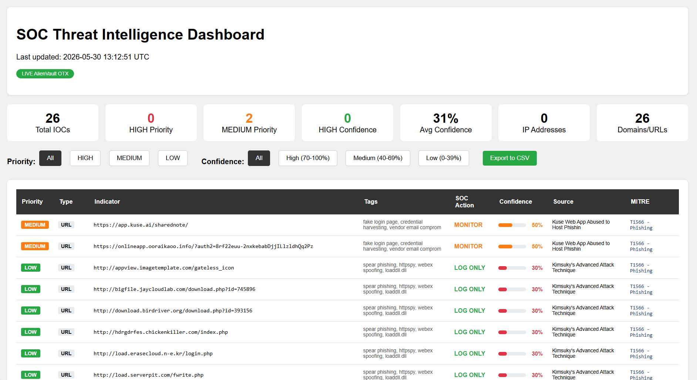

# ThreatLens - Threat Intelligence to SOC Dashboard


A production-ready Threat Intelligence Dashboard that bridges **Threat Intelligence, SOC Operations, Detection Engineering, Adversary Analysis, and Customer Security Communication** into a single workflow.

The project collects Indicators of Compromise (IOCs) from threat intelligence feeds, enriches them with contextual information, assigns confidence and priority scores, maps them to MITRE ATT&CK techniques, and presents the results through an analyst-friendly dashboard.

---

## Overview

Security teams receive large amounts of threat intelligence every day, but raw indicators alone provide limited value. Analysts need context, prioritization, and actionable guidance to make informed decisions.

This project transforms raw threat intelligence into operational intelligence by:

* Collecting IOC data from AlienVault OTX
* Assigning confidence scores
* Prioritizing threats
* Mapping indicators to MITRE ATT&CK techniques
* Providing SOC action recommendations
* Generating an interactive HTML dashboard
* Exporting results to CSV for SIEM ingestion

---

## Features

### Live Threat Intelligence Collection

* Fetches real-world IOCs from AlienVault OTX
* Supports common indicator types
* Uses current threat intelligence feeds

### IOC Confidence Scoring

Each IOC receives a confidence score between **0 and 100** based on threat context and associated intelligence tags.

### VirusTotal Enrichment (Optional)

* Validates indicators using VirusTotal
* Provides additional detection information
* Helps analysts verify malicious activity

### Priority Classification

Indicators are categorized into:

* HIGH
* MEDIUM
* LOW

This allows SOC analysts to focus on the most critical threats first.

### MITRE ATT&CK Mapping

Maps threats to relevant ATT&CK techniques, including:

| Technique | Description                |
| --------- | -------------------------- |
| T1071     | Application Layer Protocol |
| T1486     | Data Encrypted for Impact  |
| T1566     | Phishing                   |

### Interactive Dashboard

Provides:

* IOC filtering
* Priority filtering
* Confidence filtering
* Threat statistics
* Visual confidence indicators
* MITRE ATT&CK mappings
* SOC recommendations

### CSV Export

Exports analyzed IOC data into a timestamped CSV file:

```text
iocs_YYYY-MM-DDTHH-MM-SS.csv
```

Example:

```text
iocs_2026-05-30T08-01-34.csv
```

The CSV output can be used for:

* SIEM ingestion
* Threat hunting
* Security investigations
* Reporting
* IOC sharing

### Offline Demonstration Mode

If API keys are unavailable, the project automatically falls back to sample data, allowing the dashboard to be demonstrated without external dependencies.

---

## Architecture

```text
AlienVault OTX
      │
      ▼
 IOC Collection
      │
      ▼
 Threat Analysis Engine
 ├── Confidence Scoring
 ├── Priority Assignment
 ├── MITRE Mapping
 └── SOC Action Suggestions
      │
      ▼
 VirusTotal Enrichment
      │
      ▼
 Dashboard Generator
      │
      ▼
 HTML Dashboard + CSV Export
```

---

## Project Structure

```text
ThreatLens/
├── fetch_ti.py
├── dashboard_template.html
├── requirements.txt
├── README.md
├── output/
│   ├── dashboard.html
│   └── iocs_YYYY-MM-DDTHH-MM-SS.csv
└── .gitignore
```

### File Descriptions

| File                    | Purpose                                                 |
| ----------------------- | ------------------------------------------------------- |
| fetch_ti.py             | Main threat intelligence collection and analysis script |
| dashboard_template.html | Jinja2 template used to generate the dashboard          |
| requirements.txt        | Python dependencies                                     |
| output/dashboard.html   | Generated dashboard                                     |
| output/iocs_*.csv       | Exported IOC dataset                                    |
| README.md               | Project documentation                                   |

---

## Skills Demonstrated

This project showcases capabilities across multiple cybersecurity disciplines.

| Domain                 | Demonstrated Capability                          |
| ---------------------- | ------------------------------------------------ |
| Threat Intelligence    | IOC collection and enrichment                    |
| SOC Operations         | Prioritization and analyst workflows             |
| Detection Engineering  | Confidence scoring and MITRE mapping             |
| Adversary Analysis     | Threat tag interpretation and TTP identification |
| Security Communication | Risk summaries and actionable recommendations    |
| Security Automation    | Automated reporting and dashboard generation     |

---

## Installation

### Prerequisites

* Python 3.7 or higher
* pip package manager

### Clone the Repository

```bash
git clone https://github.com/YOUR_USERNAME/ThreatLens.git
cd ThreatLens
```

### Install Dependencies

```bash
pip install -r requirements.txt
```

---

## Requirements

```text
requests
jinja2
```

---

## Configuration

### AlienVault OTX API (Optional)

Set your API key as an environment variable:

```bash
export OTX_API_KEY="your_api_key"
```

### VirusTotal API (Optional)

```bash
export VT_API_KEY="your_api_key"
```

If API keys are not provided, the application automatically uses sample data.

---

## Usage

Run the main script:

```bash
python fetch_ti.py
```

---

## Output

Running the script generates:

```text
output/
├── dashboard.html
└── iocs_YYYY-MM-DDTHH-MM-SS.csv
```

### Dashboard

Open the generated dashboard in your browser:

```text
output/dashboard.html
```

The dashboard provides:

* IOC statistics
* Priority breakdown
* Confidence scores
* VirusTotal detections
* MITRE ATT&CK mappings
* SOC action recommendations

### CSV Export

The generated CSV contains:

* IOC Value
* IOC Type
* Priority
* Confidence Score
* Threat Tags
* MITRE ATT&CK Mapping
* VirusTotal Results (if enabled)
* Recommended SOC Action

This file can be imported into SIEM platforms or used during threat hunting and incident response activities.

---

## Example SOC Workflow

1. Collect indicators from AlienVault OTX
2. Analyze threat context
3. Calculate confidence scores
4. Assign threat priorities
5. Enrich indicators with VirusTotal
6. Map threats to MITRE ATT&CK
7. Generate dashboard and CSV exports
8. Share results with analysts or ingest into a SIEM

---

## Dashboard Preview

```
```

---

## Future Improvements

Potential enhancements include:

* Multiple threat intelligence feeds
* MISP integration
* STIX/TAXII support
* Splunk integration
* Elastic Security integration
* Threat actor attribution
* IOC trend visualization
* Automated IOC blocking workflows
* Sigma rule generation

---

## Learning Outcomes

This project demonstrates practical experience with:

* Threat Intelligence Operations
* IOC Enrichment
* MITRE ATT&CK Framework
* Detection Engineering Concepts
* SOC Analyst Workflows
* Security Reporting
* Security Automation

---

## Author

**Alaka Parida**

Built to demonstrate a multidisciplinary cybersecurity role combining:

* Threat Intelligence
* SOC Operations
* Detection Engineering
* Adversary Analysis
* Customer Security Communication

---

## License

This project is intended for educational, research, and portfolio purposes.
